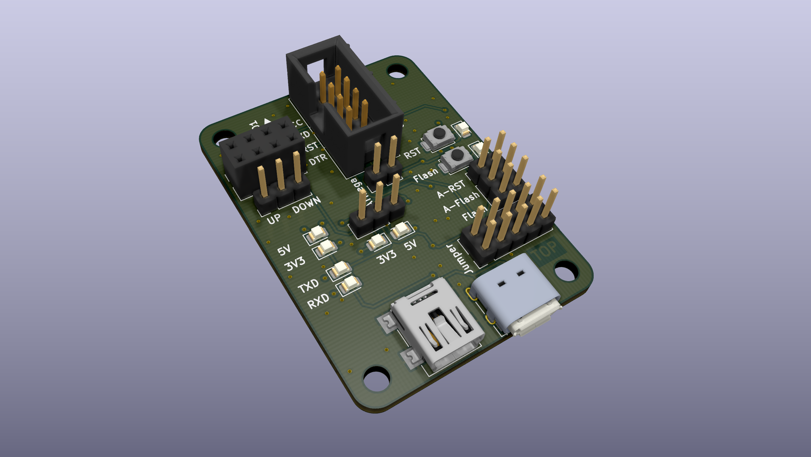
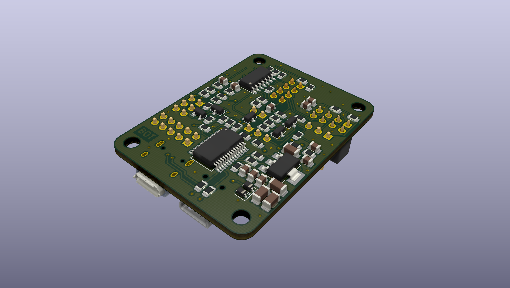
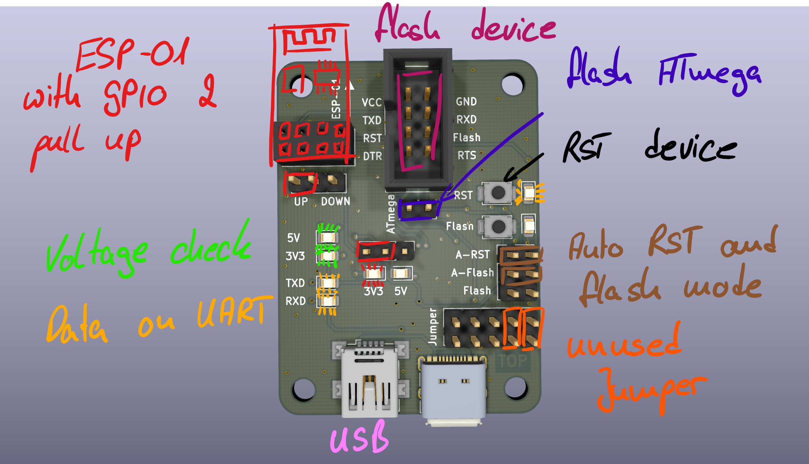

# UART flash PCB

## Features:
- flash µC over UART
	- ESP8266
	- ESP32
	- ATMEGA
	- intigrated slot for ESP8266-01
- intigrated RST and flash button
	- with LEDs and labelling
	- jumper for manual and auto mode
- Reverse polarity protected pin tray
- Three different USB sockets
	- mini USB B
	- micro USB B
	- USB C
- Vcc = 5V  or 3.3V 
	- with LEDs and labelling
	- jumper for selection
	- 5V from USB Bus
	- 3.3V from additional linear regulator in connection with internal regulator of the FT232,  with up to 800mA
- LEDs at TXD and RXD for visual control of the UART connection

## Hardware:
Gerber and drilling data are in the repository. [Component placement](./uart_flash_pcb_ibom.html)

## Software:
No stand-alone software is needed. Use esptool.py or e.g. VS Code for programming.

## Usage:
1. Connect USB
2. Connect the correct jumpers for 5V or 3.3V
3. Connect the jumpers for auto-flash and auto-RST or use the button
4. Connect the device to be flashed or plug in an ESP-01
5. be save the TXD and RXD are crossed

